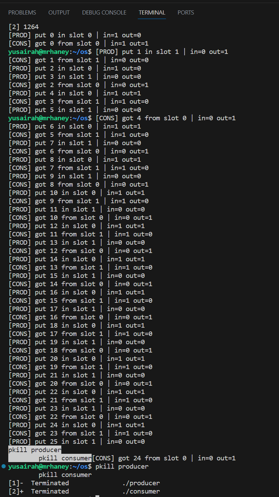

Programming Assignment #1 
Student: Yusairah Haque 
Course: Operating Systems - CS33211
Date: 10/24/2025


Overview: 
    This programming assignment (Producer-Consumer Problem) in C uses WSL in a Linux environment using POSIX shared memory (shm_open, mmap), POSIX named semaphores (sem_open, sem_wait, sem_post), and Threads (pthread_creat, pthread_join). 

The program uses two processes: 
- Producer: generates integer items and places them on a shared buffer (table).
- Consumer: removes items from the buffer. 
    The table can hold two items at a time. If the table is full, the producer waits. If the table is empty, the consumer waits. 

What was Used: 
    Language: C 
    Environment: Linux/WSL Ubuntu 
    Libraries: 
        `<pthread.h>` for threading 
        `<semaphore.h>` for synchronization 
        `<sys/mman.h>` for shared memory 
        `<fcntl.h>`, `<unistd.h>` for file descriptors

How it works: 
    Shared Memory: stores a struct with a 2-slot buffer, and indices in and out. 
    Semaphores: empty slots, filled slots, mutual exclusion. 
    Threads: each process runs one thread continuously to produce or consume.
    Circular Buffer: indices wrap using "(index+1) % N" to cycle between slot 0 and 1.

What's happening in `producer.c`: 
    Producer.c is responsible for generating integer items and placing them into a shared memory buffer that can hold two items at a time. Right when the program starts, it first creates or opens a shared memory object, sets its size with ftruncate, and maps it onto the process's address spaces with mmap. This shared region contains a structure that defines a circular buffer of size two. The producer opens three named semaphores to ensure mutual exclusion when accessing the shared buffer. Inside main, the producer waits for an empty slot, then locks the critical section. It writes a new item into the buffer, advances the index using modulo arithmetic, prints the result, and then releases the lock and signals the consumer. When the user presses Ctrl + C, a signal handler sets a flag to stop the loop, and the cleanup function automatically unmaps the shared memory and closes all semaphores. 

What's happening in `consumer.c`: 
    Consumer.c blocks when the buffer is empty, enters the critical section to read one item, updates out, unlocks, and signals a new empty slot. Shared memory and named semaphores mean the producer and consumer (separate processes) coordinate safely. Signal/cleanup make it exit gracefully and leave no leaked handles.

Project Structure: 
os/
    producer.c       # Producer program (creates items and adds to shared buffer)
    consumer.c       # Consumer program (removes items from shared buffer)
    README.md        # Project documentation, instructions, and example output
    output.png       # Example of the output 

Build Instructions (inside project folder): 
```bash
    compile: 
        gcc producer.c -pthread -lrt -o producer 
        gcc consumer.c -pthread -lrt -o consumer
    run (start both programs at once): 
        ./producer & ./consumer &
    stop programs: 
        pkill producer
        pkill consumer
```
Example Output:
    Below is a screenshot showing the producer and consumer programs running successfully:
    
